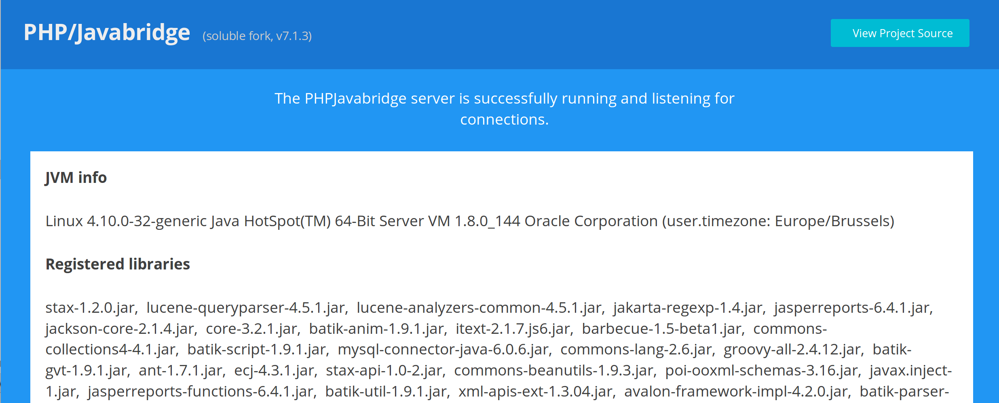

# Jasper install

## Creating the war file


```shell
# Example based on php-java-bridge master
$ git clone https://github.com/belgattitude/php-java-bridge.git
$ cd php-java-bridge
$ ./gradlew war -I init-scripts/init.jasperreports.gradle -I init-scripts/init.mysql.gradle 
```

## Deploy 

Deploy on Tomcat (example on ubuntu)

```shell
$ sudo cp ./build/libs/JavaBridgeTemplate.war /var/lib/tomcat8/webapps/JasperReports.war
```

### Check the bridge 

Point your browser to [http://localhost:8080/JasperReports](http://localhost:8080/JasperReports), you
should see the php-java-bridge dashboard page.




## Test

The bridge address can be used in the japha bridge adapter:

```php
<?php declare(strict_types=1);

use Soluble\Japha\Bridge\Adapter;

$ba = new Adapter([
    'driver' => 'Pjb62',
    'servlet_address' => 'localhost:8080/JasperReports/servlet.phpjavabridge'    
]);

// This should print your JVM version
echo $ba->javaClass('java.lang.System')->getProperty('java.version');

```


